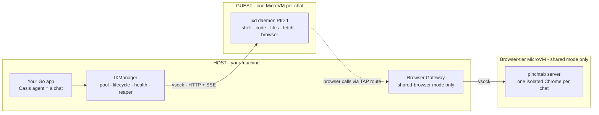
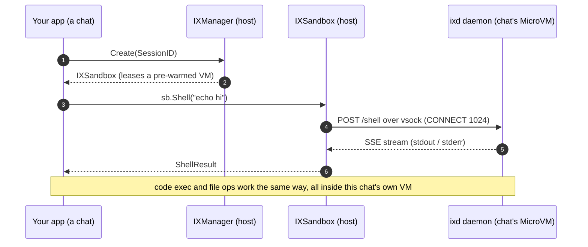
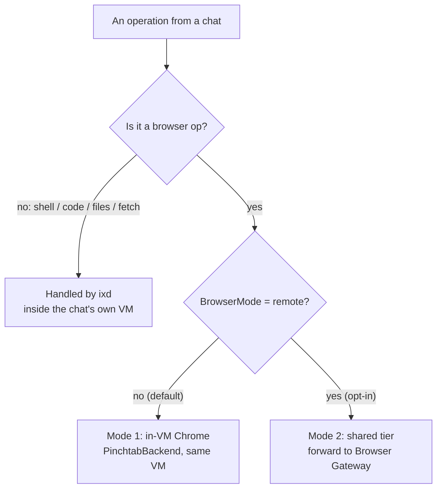
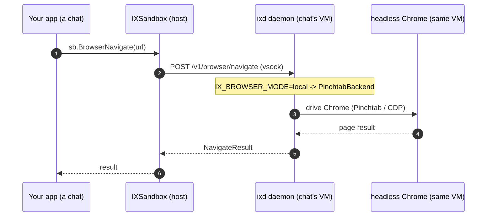
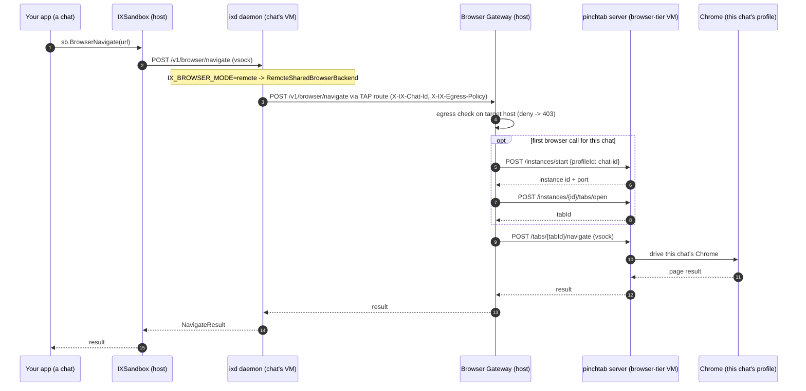

# oasis-sandbox-ix

Sandbox runtime for [Oasis](https://github.com/nevindra/oasis), the Go AI agent framework. Each sandbox is a lightweight [Firecracker](https://github.com/firecracker-microvm/firecracker) MicroVM running the `ix` daemon, communicating with the host over vsock.

> 📚 **New here?** The [ix Handbook](docs/handbook/README.md) explains everything — architecture, the browser subsystem, integration, and operations — in plain language with diagrams.

```
Your Go app
  └── ix.NewManager()           ← manages VMs, pool, lifecycle
        └── firecracker process ← Firecracker MicroVM (KVM)
              └── ix daemon     ← PID 1, HTTP+SSE on vsock:1024
```

## Architecture

ix has **two halves** that talk over a tiny, fast channel called **vsock**:

- **Go SDK (`go-sdk/`)** — a library you import into your Go app. It runs on the **host** and manages the fleet of MicroVMs: creating them, keeping a pool of pre-warmed ones, health-checking, and tearing them down. You never talk to a VM directly — you call methods on a sandbox object and the SDK forwards them.
- **Rust daemon (`daemon/`, binary `ixd`)** — runs **inside** each MicroVM as PID 1. It's an HTTP server that does the actual work: run a shell command, execute code, read/write files, fetch a URL, drive a browser.

The golden rule: **every sandbox operation is just an HTTP request from the host to the daemon.** The SDK is a thin, typed client; the daemon is the engine.

A **chat** is one Oasis session = **one MicroVM** with its own private workspace. The `Browser Gateway` and `Browser-tier MicroVM` below exist **only** if you opt into the shared-browser mode; in the default mode there's just your app, the per-chat VMs, and the daemon inside each.



### Why MicroVMs?

Each sandbox is a real [Firecracker](https://github.com/firecracker-microvm/firecracker) MicroVM — a stripped-down Linux guest that boots in tens of milliseconds behind a hard kernel/KVM isolation boundary. You get container-like speed with VM-grade isolation: untrusted agent code in one sandbox can't reach the host or any other sandbox.

### How a call travels

Take `sb.Shell(ctx, {Command: "echo hi"})`:

1. `IXSandbox.Shell` serializes the request and `POST`s it to `…/shell`.
2. The SDK's **vsock transport** dials the VM's vsock socket, sends `CONNECT 1024`, and from there it's an ordinary HTTP/TCP stream to the daemon.
3. `ixd`'s router hands it to the `ix-shell` crate, which runs the command and streams stdout/stderr back over **SSE** (server-sent events), so you see output live.
4. The SDK surfaces the result (or live stream) to your code.

Streaming operations (shell, code) use SSE; one-shot operations (file read, stat) are plain JSON.

**A chat that doesn't need a browser** stays entirely inside its own VM — shell, code, and file ops never leave it:



### Inside the daemon

`ixd` is a small Rust workspace. `ix-core` is the shared foundation (types, config, error→HTTP mapping, the SSE channel); every other crate is one leaf capability, all wired together by the `ix-server` binary:

```
ix-server (binary: ixd)
├── ix-core      shared types, config, error→HTTP mapping, SSE primitives
├── ix-shell     bash with streaming, timeouts, process-group cleanup
├── ix-code      Python/JS/Bash REPL over a stdin/stdout sentinel protocol
├── ix-files     read / write / edit / glob / grep / tree / stat / upload / download
├── ix-fetch     HTTP fetch (raw or readable text) + web search
├── ix-egress    DNS-level egress firewall (allow/deny, wildcard domains)
└── ix-browser   headless Chrome via Pinchtab (navigate/screenshot/snapshot/PDF/…)
```

The daemon is configured by **environment variables only** (`IX_ADDR`, `IX_WORKSPACE`, `IX_EGRESS_*`, …), passed in through the kernel boot args at VM start. It binds, in priority order, **vsock → Unix socket → TCP**; inside a MicroVM it's always vsock.

### VM lifecycle & the pool

`IXManager` keeps a pool of pre-warmed VMs so `Create()` is near-instant instead of a cold boot. Background goroutines monitor health (every ~10s), reap idle/expired sandboxes (default 1h TTL), and refill the pool. With snapshots enabled, a "golden" VM is booted once and its Python kernel pre-warmed, then paused and snapshotted — new sandboxes **restore** from that snapshot (≈10× faster than cold boot) and skip the readiness handshake.

### Networking & isolation

- **vsock** carries the host↔daemon API traffic — no TCP/IP networking needed between them.
- **Per-VM TAP + host NAT** gives the guest **outbound** networking (so sandboxed code can reach the internet): each VM gets its own TAP device on a private `/30` subnet, and an `nft` masquerade rule on the host forwards traffic out. VMs can't see each other's traffic.
- **Egress firewall** (`ix-egress`) enforces a DNS-level allow/deny list *inside* the VM, so a sandbox can only resolve the domains you permit (see [Egress policy](#egress-policy)).

### When a chat needs a browser

Browsing is the heaviest capability — a headless Chrome is ~700 MB of RAM — so ix offers two modes, both behind the **same** `BrowserBackend` interface (your code and API are identical either way). Which one runs is decided purely by whether you enable the shared tier (`BrowserMode: "remote"`):



**Mode 1 — in-VM (default).** Each chat's VM runs its own Pinchtab + headless Chrome. Simplest and most isolated, but it doesn't scale cheaply: 30 chats = 30 Chrome processes (~21 GB). No setup needed (`IX_BROWSER_MODE=local`).



**Mode 2 — shared browser tier (opt-in).** Set `ManagerConfig.BrowserMode: "remote"` (plus `BrowserVMImage`); `NewManager` boots the browser-tier VM and starts the gateway for you. Each chat's daemon swaps its in-VM Chrome for a `RemoteSharedBrowserBackend` that forwards browser calls — carrying `chat_id` and the egress policy in headers — to a host-side **Browser Gateway**. The gateway gives every chat its own isolated Chrome **instance** (own profile dir + cookies) inside a *single shared* **browser-tier VM** running Pinchtab in `server` mode, so many chats share one small pool of Chrome processes instead of one each. It also enforces each chat's egress policy (deny → 403) and health-checks the browser VM (down → 503).



With `BrowserMode: "remote"`, the SDK boots the browser-tier VM, starts the gateway (default `169.254.0.1:9100`), and injects `IX_BROWSER_MODE=remote=<url>` and `IX_CHAT_ID=<session id>` into each chat's VM automatically. (Alternatively, `BrowserGatewayURL` can point at an externally managed gateway.) The shared tier is **opt-in** and meant for Firecracker-host deployments; the default in-VM mode needs no extra setup. Full deployment guide: [docs/handbook/05-operations.md](docs/handbook/05-operations.md); design history: `docs/superpowers/specs/`.

## Prerequisites

- Linux x86_64 with KVM (`/dev/kvm` must exist)
- [Firecracker](https://github.com/firecracker-microvm/firecracker) v1.12+
- Go 1.22+
- Docker (only for building the rootfs image)

### Install Firecracker

```bash
cd go-sdk
./scripts/install-firecracker.sh
# Installs firecracker and jailer to /usr/local/bin/
```

### Build the rootfs

```bash
# Requires the ix Docker image to exist locally
docker build -t ix:base -f daemon/cmd/Dockerfile daemon/

# Export to an ext4 rootfs image
cd go-sdk
./scripts/build-rootfs-ext4.sh base
# Output: /opt/ix/rootfs/base.ext4
```

#### Rootfs tiers

| Tier | Contents | Size |
|---|---|---|
| `base` | Ubuntu 24.04 + Python + Node.js + ix daemon | ~750 MB |
| `browser` | base + Chrome + Pinchtab | ~1.9 GB |
| `browser-vm` | Chrome + Pinchtab server only (standalone slim; no ixd) — for the shared browser tier | ~1.3 GB |

Build a specific tier:

```bash
./scripts/build-rootfs-ext4.sh browser
# or set custom output:
IX_ROOTFS_IMAGE=/my/path/browser-vm.ext4 ./scripts/build-rootfs-ext4.sh browser-vm
```

## Install

```bash
go get github.com/nevindra/ix/go-sdk
```

## Usage

```go
package main

import (
    "context"
    "fmt"
    "log"

    ix "github.com/nevindra/ix/go-sdk"
    "github.com/nevindra/oasis/sandbox"
)

func main() {
    ctx := context.Background()

    mgr, err := ix.NewManager(ctx, ix.ManagerConfig{
        RootfsImage:    "/opt/ix/rootfs/base.ext4",
        KernelPath:     "/opt/ix/vmlinux", // path to your vmlinux kernel
        PoolSize:       3,
        PreWarmKernels: []string{"python"},
    })
    if err != nil {
        log.Fatal(err)
    }
    defer mgr.Close()

    sb, err := mgr.Create(ctx, sandbox.CreateOpts{
        SessionID: "my-session",
    })
    if err != nil {
        log.Fatal(err)
    }
    defer mgr.Destroy(ctx, "my-session")

    result, err := sb.Shell(ctx, sandbox.ShellRequest{Command: "echo hello"})
    if err != nil {
        log.Fatal(err)
    }
    fmt.Println(result.Output)
}
```

## Configuration

```go
ix.ManagerConfig{
    RootfsImage       string        // required: path to rootfs ext4 image
    KernelPath        string        // required: path to vmlinux kernel
    FCBinary          string        // firecracker binary (default: found in PATH)
    MaxConcurrent     int           // max simultaneous VMs (default: auto-detect)
    DefaultTTL        time.Duration // sandbox lifetime (default: 1h)
    PerSandbox        ix.ResourceSpec{
        VCPUs  int   // default: 1
        Memory int64 // bytes, default: 256 MiB
    }
    MaxRestarts       int              // health restarts before circuit break (default: 3)
    DefaultEgress     *ix.EgressPolicy // DNS-based egress filtering
    PoolSize          int              // pre-warmed VMs (default: 0 = disabled)
    PoolMinReady      int              // replenish threshold (default: 1)
    PoolWorkers       int              // parallel pool fill (default: 3)
    PreWarmKernels    []string         // languages to pre-boot in pool (e.g., ["python"])
    SnapshotDir       string           // golden-snapshot dir (default: /tmp/ix-golden-snapshot)
    UseSnapshot       bool             // enable snapshot/restore fast-start (default: false)
    // Shared browser tier (active when BrowserMode == "remote")
    BrowserMode       string // "" / "local" (no tier) or "remote" (boot a shared browser-tier VM)
    BrowserVMImage    string // rootfs path for the browser-tier VM (browser-vm tier)
    BrowserStateImage string // optional ext4 state disk for persistent browser profiles
    GatewayListenAddr string // host addr the gateway binds (default: 169.254.0.1:9100)
    GatewayToken      string // gateway auth token (change for prod)
    BrowserGatewayURL string // alternative: point at an externally managed gateway
}
```

### Egress policy

```go
mgr, _ := ix.NewManager(ctx, ix.ManagerConfig{
    RootfsImage: "/opt/ix/rootfs/base.ext4",
    KernelPath:  "/opt/ix/vmlinux",
    DefaultEgress: &ix.EgressPolicy{
        Enabled: true,
        Mode:    "allow",
        Rules:   []string{"pypi.org", "*.github.com", "api.openai.com"},
    },
})
```

`Mode` is `"allow"` (allowlist — only listed domains resolve) or `"deny"` (denylist — everything except listed domains). Wildcards like `*.github.com` match any subdomain. When the shared browser tier is enabled, the same policy is carried to the Browser Gateway and enforced on browser navigations too.

### Shared browser tier (optional)

By default each sandbox runs its own headless Chrome. To instead share a small pool of Chrome processes across many chats (see [When a chat needs a browser](#when-a-chat-needs-a-browser)), enable the integrated browser tier:

```go
mgr, _ := ix.NewManager(ctx, ix.ManagerConfig{
    RootfsImage:    "/opt/ix/rootfs/base.ext4",      // per-chat VMs can use the base tier
    KernelPath:     "/opt/ix/vmlinux",
    BrowserMode:    "remote",
    BrowserVMImage: "/opt/ix/rootfs/browser-vm.ext4",
})
```

`NewManager` boots the browser-tier VM, starts the host-side gateway, and makes per-chat daemons proxy browser calls to it (the SDK injects `IX_BROWSER_MODE`/`IX_CHAT_ID` for you). Build & deployment guide: [docs/handbook/05-operations.md](docs/handbook/05-operations.md).

### Environment variables

| Variable | Purpose | Default |
|---|---|---|
| `IX_ROOTFS` | Override rootfs path | `/opt/ix/rootfs/base.ext4` |

## Daemon

The Rust daemon (`daemon/`) runs inside each VM as PID 1 and exposes REST + SSE endpoints for shell execution, code execution (Python/JS/Bash), file operations, HTTP fetch, web search, browser automation, and DNS-based egress filtering.

The runtime image is also published to GHCR for Docker-based usage:

```bash
docker run --shm-size=2g -p 8080:8080 ghcr.io/nevindra/oasis-sandbox-ix:latest
```

## Tests

```bash
# Go SDK — unit tests
cd go-sdk && go test ./... -count=1

# Go SDK — integration tests (requires full stack)
cd go-sdk && go test -tags=integration -v ./...

# Rust daemon
cd daemon && cargo test --all
```

## Benchmarks

Benchmarks require a working Firecracker stack (KVM + firecracker + rootfs).

```bash
export IX_ROOTFS=/opt/ix/rootfs/base.ext4

# Quick run (5 iterations per benchmark)
cd go-sdk && ./scripts/run-benchmarks.sh

# More iterations for stable numbers
./scripts/run-benchmarks.sh 20

# Individual benchmarks
go test -bench=BenchmarkCreateCold -benchtime=10x -tags=integration -count=1 .
```

| Operation | Docker (v0.2) | Target (cold) | Target (pool) |
|---|---|---|---|
| Creation | 368 ms | < 100 ms | < 1 ms |
| Shell echo | 42 ms | < 12 ms | < 3 ms |
| File R+W | 45 ms | < 6 ms | < 6 ms |
| Code exec (warm) | 53 ms | < 10 ms | < 10 ms |
| First code exec | 2,750 ms | < 300 ms | < 10 ms |
| E2E agent cycle | 393 ms | < 50 ms | < 25 ms |

## License
