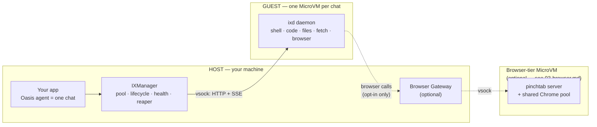

# 01 — What is ix?

<!-- source-of-truth: README.md, CLAUDE.md -->

> **Who should read this:** Anyone building with or evaluating ix — whether you are a Go developer integrating a sandbox runtime, a PM scoping what AI agents can safely do, or a founder deciding how to ship an agent product. No deep systems knowledge required.
>
> **What you'll learn:** Why running AI-agent code directly on your machine is dangerous, how ix fixes that with disposable virtual machines, what a sandbox can actually do, who the main components are, and what the performance numbers mean in practice.

---

## The problem

AI agents are useful precisely because they act: they write code, run it, edit files, install packages, browse the web, and call APIs. That action is the point.

But that action also has a dark side. What happens if an agent runs `rm -rf ~`? What if it silently exfiltrates an API key it found in a config file? What if a model is compromised and starts mining cryptocurrency in the background? What if a bug causes it to overwrite a production database?

These are not hypothetical edge cases. Any code-running agent — yours, a library's, a third-party tool's — can make these mistakes. Running that code directly on your laptop or server gives it the same permissions you have. A single bad instruction can cause irreversible damage.

You also cannot audit every line an agent produces before running it. That is the whole point of automation. So the question is not "will agents ever make mistakes?" It is "how do we contain the blast radius when they do?"

---

## The solution: disposable rooms

Think of ix like a hotel.

Each guest (each AI chat session) checks into their own private room. The room has everything they need: a filesystem, a network connection, the ability to run code. The guest can make any mess they like inside. They can rearrange the furniture, paint the walls, break the TV.

When they check out, the room is destroyed entirely. The mess disappears. The next guest gets a fresh room that looks exactly like the original. Nothing leaks between rooms. Nothing leaks to the rest of the building.

In ix terms, the "room" is a **MicroVM** — a real virtual machine, but stripped down to the bare minimum so it boots in tens of milliseconds instead of the 30–60 seconds you might expect. MicroVM is the name for the class of lightweight virtual machines pioneered by AWS with [Firecracker](https://firecracker-microvm.io/). Each one runs a complete Linux kernel inside it, isolated from the host by the hardware's own virtualization engine (KVM). What happens inside cannot escape — not to the host, not to any other VM.

When the agent session ends, `IXManager` destroys the VM. No cleanup scripts, no leftover processes, no lingering state.

---

## Why MicroVMs and not Docker containers?

You might already be using Docker containers for isolation. Containers are great — they are simple, fast, and widely understood. But they share the host's operating system kernel. That shared boundary is where container escapes happen: a kernel vulnerability in the host can become an escape route for any container running on it.

MicroVMs run their own kernel. The isolation boundary is enforced by hardware virtualization (KVM), not software. There is no shared kernel to exploit.

| | Docker container | ix MicroVM |
|---|---|---|
| Isolation boundary | Shared host kernel (software) | Hardware-enforced KVM |
| Kernel escape risk | Real — kernel CVEs can affect all containers | Contained — each VM has its own kernel |
| Boot time | Milliseconds | Tens of milliseconds (Firecracker) |
| Memory overhead | Low (~10–20 MB per container) | Low (256 MB default per VM, including the guest OS) |
| Setup complexity | Simple | Requires KVM and a Firecracker binary |

The honest trade-off: containers are easier to run and use less memory. ix chooses VM-grade isolation because agent code is fundamentally untrusted — it comes from a model, not from a human who has reviewed it — and Firecracker makes virtual machines nearly as cheap as containers.

---

## What a sandbox can do

Once an agent has a sandbox, here is what it can use:

**Shell commands.** Run any bash command and stream the output back live, exactly as if you were watching a terminal. Commands time out cleanly and do not leave orphan processes behind.

**Code execution.** A warm Python, JavaScript, or Bash REPL (a read-eval-print loop — an interpreter that stays running and remembers variables between calls) lives inside each sandbox. After the first call warms it up, subsequent calls execute in roughly 10 milliseconds.

**File operations.** Read, write, edit, search, list, upload, and download files inside the sandbox's private workspace. Changes persist for the lifetime of the sandbox and disappear when it is destroyed.

**Web fetch and search.** The agent can fetch any URL and get back either raw HTML or extracted readable text. It can also run web searches — useful for grounding responses in current information.

**Full browser automation.** A real headless Chrome browser runs inside the sandbox. The agent can navigate to pages, take screenshots, interact with forms and buttons, read the DOM, generate PDFs, and run JavaScript on the page.

**Egress firewall.** A DNS-level allowlist or denylist — think of it as a guest list for the internet. You declare which domains the sandbox is allowed to contact. Anything not on the list simply does not resolve. This keeps a compromised or confused agent from calling home to unexpected destinations.

---

## The cast of characters

Here is the whole system in one picture:

**Your app** is whatever you are building. It imports the Go SDK and calls sandbox methods as though it were calling a local library. It never talks to a VM directly.

**IXManager** is the fleet manager. It keeps a pool of pre-warmed VMs ready so handing a new chat its sandbox is near-instant. It monitors health, restarts unhealthy VMs, reaps expired ones, and fills the pool back up in the background.

**ixd (the daemon)** runs inside each MicroVM as the very first process (PID 1). It is a small, fast Rust HTTP server that does the actual work: executes commands, drives the REPL, manages files, fetches URLs, and controls Chrome. The host never enters the VM — it just sends HTTP requests over vsock (a fast VM-to-host channel that needs no network stack) and streams results back.

**Browser Gateway + shared browser tier** are optional. If you are running many concurrent chats and do not want each one to carry a full 700 MB Chrome process, you can enable a shared browser tier: a single extra MicroVM holds a small pool of Chrome instances, and a gateway (which runs on the host, inside your app's process) routes each chat to its own isolated browser profile. See `03-browser.md` for details.

---

## Performance and cost intuition

The benchmark table in the README compares an older Docker-based approach with the Firecracker targets. Here is what those numbers mean for real workloads:

**Creating a sandbox is near-instant with pooling.** Cold-booting a VM takes under 100 ms. But `IXManager` pre-warms a pool, so `Create()` typically just leases an already-running VM — the target is under 1 ms. From your agent's perspective, the sandbox is always ready.

**The warm REPL is fast.** A Python code execution on an already-warm kernel targets under 10 ms. The first call in a session warms the interpreter (target: under 300 ms); every call after that is the fast path.

**Memory cost is real but manageable.** Each VM defaults to 256 MB of RAM (enough for the base tier; you allocate more per VM if you need heavier workloads). On a 64 GB host, that means roughly 200 concurrent sandboxes fit in RAM with comfortable headroom for the host OS. If you use the browser-in-VM mode, Chrome adds roughly 700 MB more per sandbox — plan on ~1 GB each — dropping capacity to a few dozen concurrent browser sessions on the same host. The shared browser tier exists exactly to address this: many chats share one pool of Chrome processes instead of one each.

**Rootfs tiers are "how much stuff is pre-installed in the room."** When you build a MicroVM image, you pick a tier:

| Tier | What is inside | Disk size |
|---|---|---|
| `base` | Ubuntu 24.04 + Python + Node.js + ixd | ~600 MB |
| `browser` | base + Chrome + Pinchtab (browser driver) | ~1.5 GB |

Start with `base` unless your agent needs to browse the web inside its own VM (use `browser`). A smaller image means faster rootfs loads and less disk pressure when running many VMs. (Need extra Python packages? Agents can install them at runtime with `uv`, or you can bake them into a custom Docker stage.)

---

## Where to go next

- [README.md](../../README.md) — index of the whole project, quickstart, configuration reference
- [02-architecture.md](02-architecture.md) — how ix works inside: the Go SDK, the Rust daemon, vsock transport, the VM lifecycle
- [03-browser.md](03-browser.md) — the two browser modes in depth, when to use each, how the shared tier scales
- [04-integration.md](04-integration.md) — plugging ix into your Go app step by step
- [05-operations.md](05-operations.md) — running ix in production: prerequisites, rootfs builds, egress policy, monitoring
