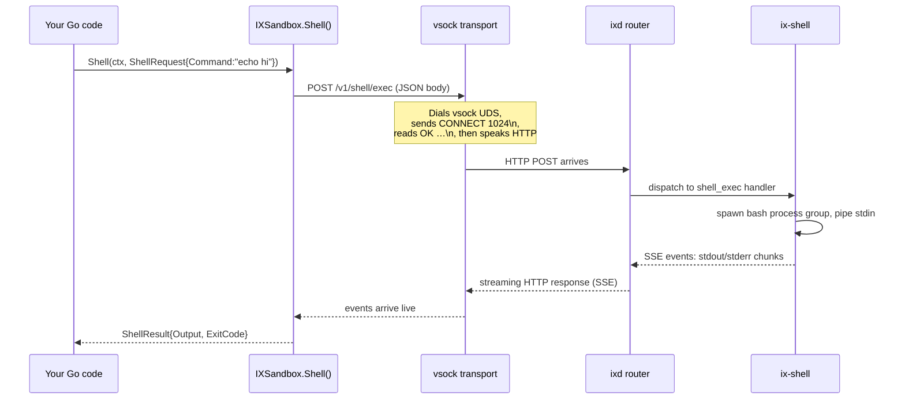
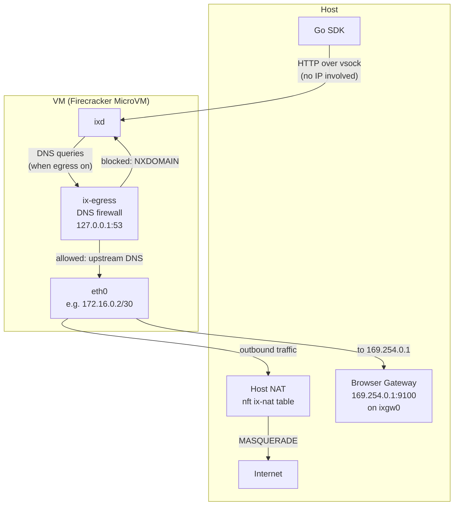

<!-- source-of-truth: daemon/crates/*, go-sdk/manager.go, go-sdk/sandbox.go, go-sdk/vmm.go, go-sdk/vmm_vsock.go, go-sdk/network.go, go-sdk/reaper.go, go-sdk/health.go, go-sdk/snapshot.go, docs/superpowers/specs/2026-06-03-vm-networking-tap-nat-design.md -->

# 02 — Architecture

> **Who should read this:** engineers integrating ix into an AI agent system, or anyone who wants to understand how the pieces fit together.
> **What you'll learn:** how the Go SDK and Rust daemon divide responsibilities, how a single operation travels from your code into a running VM and back, what each daemon subsystem does, how IXManager keeps VMs healthy and ready, and how three networking layers stack on top of each other to give each sandbox both isolation and internet access.

---

## 1. Two halves

ix has exactly two pieces: a **Go SDK** that runs on your host machine and a **Rust daemon** (`ixd`) that runs inside each VM.

The **Go SDK** is a thin typed client. It creates and destroys Firecracker MicroVMs — Firecracker being a small, fast virtual machine monitor purpose-built by AWS for sandboxing — and for every sandbox operation it sends an HTTP request to the daemon running inside that VM.

The **Rust daemon** (`ixd`) is the engine. It runs as the first process inside the VM (PID 1 equivalent, after a tiny init script), listens for HTTP requests over vsock — explained in section 5 — and executes everything: shell commands, code, file ops, browser, fetch, and egress control.

The golden rule: **every sandbox operation is just an HTTP request from host to daemon.**

```
Your code (Go)
    │
    ▼
IXManager / IXSandbox   ← thin typed client, lives on the host
    │  HTTP over vsock
    ▼
ixd (Rust)              ← inside the Firecracker VM
    │
    ▼
ix-shell / ix-code / ix-files / ix-browser / ...
```

This clean separation means the SDK never has to know what language your code is or what the filesystem looks like inside. It just sends JSON and reads back JSON or a stream.

---

## 2. Anatomy of one request

Here is what happens when you call `sb.Shell(ctx, "echo hi")`.



**The vsock handshake.** When the SDK needs to talk to the daemon, it dials a Unix domain socket (a local file-based socket) that Firecracker exposes on the host, sends `CONNECT 1024\n`, reads back `OK …\n`, and from that point the connection behaves like an ordinary TCP stream to the daemon's HTTP port. No network card is involved.

**SSE — server-sent events.** Shell and code execution use SSE: a one-way live ticker over HTTP where the server pushes small JSON events (`{"text":"hi\n"}`) as they happen. The SDK drains these events into a result buffer and returns when it sees the `complete` or `error` event.

**One-shot JSON operations** — file read, stat, workspace info — use plain POST/GET with a JSON request and a JSON response. No streaming.

---

## 3. The daemon up close

### Crate map

`ixd` is built from eight Rust crates. Every crate except `ix-core` is a leaf; none depend on each other.

| Crate | What it does |
|---|---|
| `ix-core` | Shared types, config (`DaemonConfig`), error-to-HTTP mapping, SSE channel primitives. The foundation everything else builds on. |
| `ix-shell` | Bash execution with streaming output, timeouts, and process-group cleanup so child processes can't outlive their command. |
| `ix-code` | Polyglot REPL (Python, JavaScript, Bash) via a stdin/stdout sentinel protocol — one persistent kernel process per language, reused across calls. |
| `ix-files` | Read, write, edit, glob, grep, tree, stat, hash (streaming sha256), upload, and download. |
| `ix-fetch` | HTTP fetch (raw or readable-text extraction) and web search via Startpage. |
| `ix-egress` | DNS-level egress firewall — intercepts DNS queries on `127.0.0.1:53` and blocks non-allowed domains. |
| `ix-browser` | Headless Chrome via Pinchtab — navigate, screenshot, action, DOM snapshot, PDF, eval, find, wait. |
| `ix-server` | The `ixd` binary: wires all crates together, builds the Axum router, selects the transport, and handles graceful shutdown. |

### Configuration

The daemon has no config files. Everything is environment variables. The Go SDK injects them as kernel boot arguments (`ix.env.KEY=VALUE` on the kernel command line); the `ix-init` script reads `/proc/cmdline` and exports them before `ixd` starts.

Key variables (`ix-core/src/config.rs`):

| Variable | Default | Purpose |
|---|---|---|
| `IX_ADDR` | `0.0.0.0:8080` | TCP listen address (fallback transport) |
| `IX_SOCKET` | — | Unix socket path (second-priority transport) |
| `IX_VSOCK_PORT` | — | Vsock port (highest-priority transport, used in production) |
| `IX_VSOCK_READY_PORT` | — | Port the daemon uses to send the `READY\n` signal to the host |
| `IX_WORKSPACE` | `/workspace` | Default working directory for file and shell ops |
| `IX_EGRESS_ENABLED` | `false` | Activate the DNS firewall |
| `IX_EGRESS_MODE` | `allow` | `allow` (allowlist) or `deny` (denylist) |
| `IX_EGRESS_RULES` | — | Comma-separated domain rules, wildcards supported |
| `IX_BROWSER_MODE` | `local` | `local`, `remote=<url>`, or `disabled` |
| `IX_CHAT_ID` | — | Per-sandbox chat ID forwarded to the shared browser gateway |
| `IX_BROWSER_GATEWAY_TOKEN` | — | Bearer token for the shared browser gateway |

### Transport priority

On startup `ixd` checks (in this order): vsock port set → Unix socket set → fall back to TCP. In production each VM uses vsock. The `READY\n` signal is sent over vsock after the daemon binds its listener, so the host knows the VM is accepting requests before it hands the sandbox to your code.

### Two API surfaces

The router (`ix-server/src/router.rs`) exposes two URL namespaces on the same server:

- **`/v1/...`** — ix-native routes. These are what `IXSandbox` in the Go SDK calls.
- **`/sandboxes/{id}/...`** — E2B-compatible routes (the `{id}` path parameter is captured but ignored). Useful if you have existing code written against the E2B sandbox API.

Both surfaces share the same underlying handlers.

---

## 4. The manager up close

`IXManager` (`go-sdk/manager.go`) is the fleet manager. It owns the VM lifecycle: creating, monitoring, and destroying Firecracker VMs.

### Pre-warmed pool

Creating a VM from scratch takes a few seconds (booting the kernel, starting `ixd`, waiting for the `READY` signal). The pool solves this: the manager boots VMs in advance and keeps them idling, ready to be handed out instantly. Think of it like a valet service that always keeps a few cars running at the kerb — when you call `Create()`, you get one of the ready cars, not a car that still needs to be started.

`PoolSize` sets how many VMs to keep ready. `PoolWorkers` (default: 3) controls how many VMs boot in parallel when the pool needs filling. `PoolMinReady` (default: 1) triggers a refill when the pool drops below this count.

When `Create()` grabs a pool entry, it fires off an async goroutine to start replenishing immediately.

The pool also supports **kernel pre-warming** (`PreWarmKernels`): after the VM is ready, the pool entry sends an empty code-execution request so the Python (or other language) interpreter is already loaded when the sandbox is claimed.

### Background goroutines

Three goroutines run continuously after `NewManager`:

1. **Monitor** (`health.go`) — every **10 seconds**, health-checks every live sandbox by calling `/health`. Three consecutive failures trigger a restart. After `MaxRestarts` (default: 3) failed restarts the sandbox is destroyed (circuit breaker).

2. **Reaper** (`reaper.go`) — every **30 seconds**, destroys sandboxes whose TTL has elapsed (default TTL: 1 hour), and evicts the oldest sandbox if free disk space on the rootfs path falls below 5 GB.

3. **Pool replenisher** — every **1 second**, checks if the pool is below `PoolMinReady` and triggers a fill if so.

### Golden snapshots

Firecracker supports VM snapshots: pause a running VM, write its full memory and disk state to files, then restore clones from those files far faster than cold-booting. `SnapshotManager` (`go-sdk/snapshot.go`) automates this:

1. **`CreateGolden`** — cold-boots a VM, waits for `ixd` to be `READY`, optionally pre-warms language kernels, pauses the VM, writes a Full snapshot to `SnapshotDir`, then kills the golden VM.
2. **`Restore`** — loads the golden snapshot via the Firecracker snapshot/load API. Because `ixd` was already running when the snapshot was taken, no `READY` handshake is needed — just a short `/health` poll. Restores are roughly 10x faster than a cold boot. Think of it like loading a saved game: the emulator jumps straight to a known-good state.

> **Current limitation:** networking and snapshots are not yet combined. A snapshot-restored VM is vsock-only — it has no TAP device and cannot reach the internet or the shared browser gateway. Run per-chat VMs from the pre-warm pool (cold-boot) until a follow-up adds snapshot networking.

### Concurrency

`MaxConcurrent` bounds how many VMs can run at once. If `0`, the manager auto-detects a safe limit from host CPU and RAM divided by per-VM resources. When all slots are taken, `Create()` attempts to evict the oldest expired sandbox first, then queues for up to 30 seconds before returning `ErrCapacityFull`.

### Disk model: immutable base + per-VM scratch

Every VM shares a single read-only rootfs image (`base.ext4`, or `browser.ext4`, etc.) mounted at `/dev/vda`. Sharing one image across all VMs saves disk space and prevents writes in one sandbox from corrupting the filesystem seen by another.

Each VM also gets its own private sparse scratch disk (`scratch.ext4`) at `/dev/vdb`, placed under `RunDir` (default: `<dir of RootfsImage>/run/ix-<id>/`). The scratch disk is pre-allocated as a sparse file (default 10 GB; configurable via `ScratchSizeMB`) — it uses only the space actually written.

At boot, a small pre-init binary `/sbin/ix-stage0` runs before `ixd`. It:

1. Mounts `/dev/vdb` (the scratch disk) read-write at `/scratch`.
2. Builds a whole-root overlayfs: `lowerdir=/`, `upperdir=/scratch/upper`, `workdir=/scratch/work`.
3. `pivot_root`s into the overlay, so all writes to `/etc`, `/workspace`, pip installs, `__pycache__`, and any other path land transparently on the scratch disk.
4. Execs the normal per-tier init (`ix-init.sh`), which starts `ixd`.

From `ixd`'s perspective the filesystem looks fully writable — the overlay is transparent.

```
Host:
  /opt/ix/rootfs/base.ext4          SHARED, immutable (is_read_only: true)
  <RunDir>/scratch-template.ext4    empty sparse ext4, made once at manager start
  <RunDir>/ix-<id>/scratch.ext4     per-VM, sparse ext4, rw (drive "scratch")
  <RunDir>/ix-<id>/{fc.sock, vsock.uds}

Guest:
  /dev/vda   root, mounted ro       (boot args: root=/dev/vda ro)
  /dev/vdb   scratch, mounted rw at /scratch
  overlayfs: lowerdir=/, upperdir=/scratch/upper, workdir=/scratch/work
  pivot_root into the overlay; all writes (/etc, /workspace, pip installs,
  __pycache__) land in the scratch disk
```

**Snapshots and the scratch disk.** The scratch drive is registered with Firecracker under the relative path `"scratch.ext4"` (resolved against the Firecracker process CWD, which is the per-VM run directory). This means snapshot state files reference a relative path and remain valid when snapshot directories are moved. When `CreateGolden` takes a snapshot it preserves that VM's scratch as `scratch.golden.ext4`; `Restore` copies it for each clone so every restored VM starts from the same clean-but-pre-warmed disk state.

---

## 5. Networking and isolation — three layers

Each sandbox has three distinct networking layers. They stack on top of each other and compose cleanly.



### Layer 1: vsock — the control channel

vsock — a direct pipe between the host and a VM with no IP networking involved — carries all API traffic between the SDK and `ixd`. The host dials Firecracker's vsock UDS proxy, exchanges the `CONNECT 1024 / OK` handshake, and from that point speaks plain HTTP. This path is completely separate from the VM's network interface and is always available regardless of whether the VM has internet access.

### Layer 2: per-VM TAP device + host NAT — outbound internet

(An earlier iteration used `passt` for this; it never worked with Firecracker, which only speaks TAP, and was replaced. If you see `passt` mentioned anywhere, that text is stale.)

When a VM cold-boots, the manager allocates a TAP device — a virtual Ethernet interface the host creates and bridges to a Firecracker network interface. The address space is `172.16.0.0/16`, carved into `/30` subnets (four addresses each), one per VM. For VM at index `n`:

- TAP name on host: `ixtap<n>`
- Host/gateway IP: `172.16.0.(4n+1)`
- Guest IP: `172.16.0.(4n+2)`
- Mask: `255.255.255.252`

The guest MAC is derived deterministically from the guest IP (`06:00:<ip-as-hex-octets>`).

The TAP is wired to the VM via Firecracker's `PUT /network-interfaces` API. The guest's kernel is told its addressing via the `ip=` boot argument (`ip=<guest>::<gateway>:255.255.255.252::eth0:off:8.8.8.8`) — the kernel configures `eth0` and DNS automatically at boot, no `iproute2` needed.

At manager startup, `ensureHostNAT` runs once: it enables `net.ipv4.ip_forward` and loads an idempotent `nft` ruleset (table `ix-nat`) that MASQUERADE-s any packet from `172.16.0.0/16` out through the host's uplink. On hosts where Docker (or another tool) sets `iptables FORWARD DROP`, `ensureForwardAccept` also adds an explicit `iptables ACCEPT` for `ixtap+` traffic so the masquerade actually runs.

When a packet leaves the VM:

```
guest app → eth0 → TAP (ixtap<n>) → host kernel → nft MASQUERADE → uplink → internet
```

Because each VM gets its own `/30` subnet, VMs cannot see each other's traffic.

**Shared browser gateway (browser-remote mode).** When the browser tier is active, the host gateway runs at a fixed link-local address (`169.254.0.1:9100`). Since each VM's host-side gateway IP is different (`172.16.0.{4n+1}`), nothing on the host normally owns `169.254.0.1`. `ensureGatewayAddr` solves this by assigning that address to a host dummy interface (`ixgw0`). A guest's packet destined for `169.254.0.1` follows its default route to `ixtap<n>`, and the host delivers it locally to the gateway socket — no NAT involved.

### Layer 3: ix-egress DNS firewall — domain-level control

When egress filtering is enabled (`IX_EGRESS_ENABLED=true`), `ix-egress` starts a DNS proxy inside the VM on `127.0.0.1:53` and rewrites `/etc/resolv.conf` to point there. Every DNS query the VM makes is intercepted. The policy (allowlist or denylist) is checked against the queried domain; blocked domains get an `NXDOMAIN` response. Allowed queries are forwarded to an upstream resolver. Wildcard rules (`*.example.com`) are supported. The policy can be updated at runtime via `PatchEgress()` without restarting the VM.

This layer composes with Layer 2: NAT provides L3 reachability, and the DNS firewall controls which names resolve. A process in the VM that hard-codes an IP address bypasses the DNS check — this is a known and accepted trade-off of a DNS-only firewall.

---

## 6. Security model

**What sandboxed code cannot do:**

- Access the host filesystem. The VM's rootfs is a separate ext4 image. The host directory tree is not visible inside.
- See other VMs' traffic or filesystems. Each VM has its own isolated `/30` subnet and its own disk image.
- Call non-allowlisted domains when egress filtering is on. The DNS firewall blocks resolution before a TCP connection can be made.
- Exhaust host resources beyond its allocation. Each VM has a fixed vCPU count and memory cap set in `ManagerConfig.PerSandbox`.

**What sandboxed code can do:**

- Run as root inside its own VM. There is no user-level isolation inside the VM — code runs with full privileges within the MicroVM's kernel. That is intentional: Firecracker provides the isolation boundary. The VM kernel is the security layer, not Linux capabilities inside it.
- Make outbound network requests to any destination (unless egress filtering is on). With egress off, the VM's NAT path reaches the internet without restriction.

The overall model is: **strong isolation between VMs and between VMs and the host; intentionally permissive inside a single VM.** If you need fine-grained intra-VM restrictions, turn on `IX_EGRESS_ENABLED` and supply a ruleset.

---

## Where to go next

- [`README.md`](../../README.md) — project index and quick-start
- [`01-what-is-ix.md`](01-what-is-ix.md) — the big picture: what ix is and why it exists
- [`03-browser.md`](03-browser.md) — the browser subsystem in depth (Pinchtab, shared browser tier, remote mode)
- [`04-integration.md`](04-integration.md) — how to integrate ix into your agent application
- [`05-operations.md`](05-operations.md) — running ix in production (networking setup, capabilities, monitoring)
