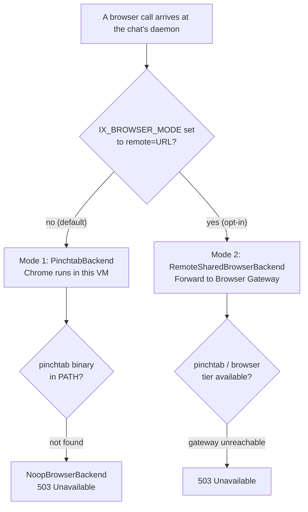
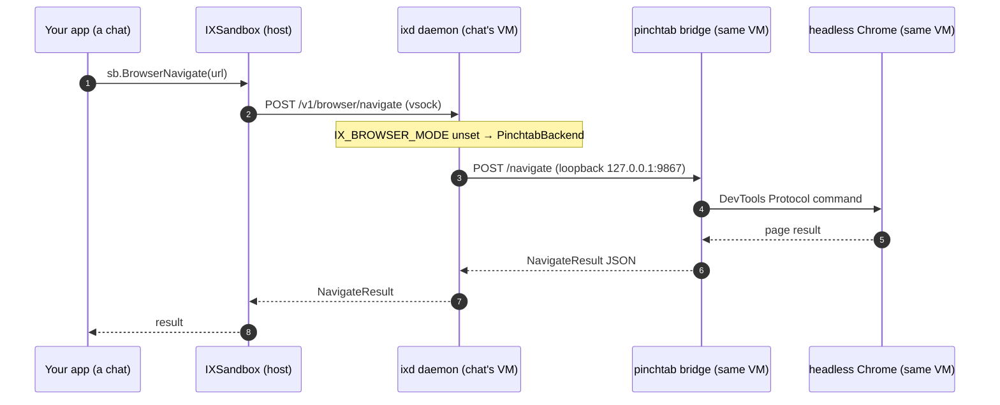
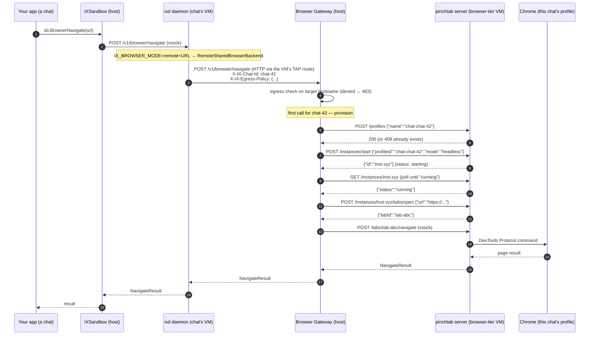

# 03 — The Browser Subsystem

<!-- source-of-truth: daemon/crates/ix-browser/src/*, go-sdk/gateway.go, daemon/cmd/browser-vm-init.sh, oasis sandbox/tools.go -->

> **Who should read this:** anyone building with ix who needs an agent to open web pages, click things, extract content, or fill forms. Also useful if you are debugging a browser call or deciding whether to enable the shared-browser tier.
>
> **What you'll learn:** why the browser gets its own architecture, the two modes and when to use each, every agent-facing browser tool, and the specific quirks you will hit if you do not read this section.

---

## 1. Why browsers are special

Every capability in ix is lightweight except one. A shell command runs in microseconds and uses kilobytes of RAM. A Python REPL kernel sits in a few tens of megabytes. A headless Chrome — a real browser with no visible window, controlled through an API instead of a mouse — consumes roughly **700 MB of RAM** just to exist.

Do the math: 30 concurrent chats, each with its own Chrome, equals about **21 GB of RAM** consumed by browsers alone, before any actual work. At 100 chats that becomes 70 GB.

That is why the browser subsystem has two modes and a dedicated piece of infrastructure. Everything else in ix can live entirely inside each chat's own MicroVM. The browser is the exception — it is big enough to warrant sharing.

---

## 2. One interface, two modes

Despite the architectural difference, your agent code is identical regardless of which mode runs. Both modes implement the same **`BrowserBackend` trait** — the single interface that the `ix-browser` crate defines:

```rust
// daemon/crates/ix-browser/src/backend.rs
pub trait BrowserBackend: Send + Sync {
    async fn navigate(&self, url: &str)                 -> Result<NavigateResult>;
    async fn screenshot(&self)                          -> Result<Vec<u8>>;
    async fn action(&self, action: BrowserAction)       -> Result<BrowserResult>;
    async fn snapshot(&self, opts: SnapshotOpts)        -> Result<BrowserSnapshot>;
    async fn text(&self, opts: TextOpts)                -> Result<BrowserTextResult>;
    async fn pdf(&self)                                 -> Result<Vec<u8>>;
    async fn eval(&self, expr: &str)                    -> Result<String>;
    async fn find(&self, query: &str)                   -> Result<BrowserFindResult>;
    async fn wait(&self, opts: BrowserWaitOpts)         -> Result<BrowserWaitResult>;
    fn available(&self)                                 -> bool;
}
```

Three concrete types implement this trait:

| Type | When selected | What it does |
|---|---|---|
| `PinchtabBackend` | Default (local mode) | Spawns pinchtab + Chrome inside the chat's own VM |
| `RemoteSharedBrowserBackend` | Shared tier (remote mode) | Forwards calls to the host Browser Gateway over HTTP |
| `NoopBrowserBackend` | Rootfs has no browser | Returns `503 Unavailable` for every call |

**How the mode is chosen.** The switch lives in `ManagerConfig`. Setting `BrowserMode: "remote"` (plus `BrowserVMImage`) makes `NewManager` boot the shared browser-tier VM, start the host-side gateway, and compute the gateway URL itself — see [05-operations.md](05-operations.md) for the full deployment. (Alternatively, `BrowserGatewayURL` can point at an externally managed gateway.) Either way, the SDK then injects two environment variables into every chat's VM at boot: `IX_BROWSER_MODE=remote=<url>` and `IX_CHAT_ID=<session-id>`. The daemon's startup reads those variables and picks the right backend. With neither field set (the default), no extra variables are injected and the daemon defaults to local mode.



Your Go application code and the agent's tool calls look identical in both modes. The switch is purely a deployment configuration.

---

## 3. Mode 1 — in-VM Chrome (default)

In this mode every chat's MicroVM runs its own pinchtab process (pinchtab is the bridge between the daemon and Chrome's DevTools Protocol — a standardised debug/automation API) and its own headless Chrome instance. Browser calls never leave the VM.



On startup, `PinchtabBackend` writes a config file to `/tmp/pinchtab/config.json`, then spawns `pinchtab bridge` as a child process. It polls `/health` with exponential back-off (up to 15 s) before marking the backend available.

**When to use it:** always, unless you are running many concurrent chats and RAM is a constraint.

**Requirement:** the `browser` rootfs tier must be used. The `base` tier does not include Chrome or pinchtab, and the backend silently becomes `NoopBrowserBackend` if `pinchtab` is not found in PATH.

**Trade-offs:**

- Strongest isolation: each chat has a completely private Chrome instance, profile, and process.
- Zero extra setup: no gateway, no shared VM, no extra config.
- Does not scale cheaply: 30 chats = 30 Chrome processes (~21 GB).

---

## 4. Mode 2 — shared browser tier (opt-in)

In this mode the browser moves out of the per-chat VM. Each chat's daemon becomes a thin client (`RemoteSharedBrowserBackend`) that forwards every browser call over HTTP to a host-side **Browser Gateway**. The gateway manages a single shared **browser-tier MicroVM** that runs pinchtab in `server` mode — a multi-instance orchestrator that can host many Chrome processes at once.

### What the daemon sends

Every request from `RemoteSharedBrowserBackend` carries two extra HTTP headers:

- `X-IX-Chat-Id` — the chat's session ID, used by the gateway to route to the right Chrome instance.
- `X-IX-Egress-Policy` — the chat's egress rules, serialised as JSON, so the gateway can enforce them before forwarding.

### What the gateway does

The gateway (`go-sdk/gateway.go`) exposes the same `/v1/browser/*` URL paths the daemon's routes use. It:

1. **Whitelists operations.** Only the nine operations in `browserOps` are accepted: `navigate, screenshot, action, snapshot, text, pdf, evaluate, find, wait`. Anything else gets 404.
2. **Checks egress on navigate.** Extracts the target hostname from the request body and evaluates it against the policy in the header. If the domain is blocked, it returns 403 immediately — no upstream call is made.
3. **Lazily provisions a Chrome instance per chat.** On the first browser call for a given `chat-id`, the gateway creates a pinchtab profile named `chat-<chat-id>`, starts a pinchtab instance backed by that profile, waits for it to reach `running` status, then opens a tab. All subsequent calls reuse the same instance and tab. Chats share the VM but **never share a Chrome profile** — each chat gets its own profile directory and cookie store.
4. **Health-checks the browser VM.** A background goroutine polls pinchtab's `/health` every 10 seconds. Three consecutive failures flip the state to `unhealthy` and the gateway returns 503 for all browser calls until the VM recovers.
5. **Limits concurrency.** A semaphore (default 32 slots) caps total in-flight calls across all chats. A per-chat mutex ensures at most one browser op per chat is in flight at a time.

### First-call sequence



After provisioning, subsequent calls skip steps 7–13 and go directly to the tab.

### Isolation guarantee

Chats share one VM and one pinchtab process, but **each chat has its own Chrome instance and on-disk profile directory** (cookies, localStorage, session storage). One chat cannot read another chat's session data. The blast radius of a compromised or misbehaving browser is bounded to the browser-tier VM — the kernel/KVM boundary between that VM and the host is never crossed.

### Enabling the shared tier

```go
mgr, _ := ix.NewManager(ctx, ix.ManagerConfig{
    RootfsImage:    "/opt/ix/rootfs/base.ext4",          // per-chat VMs can use base tier
    KernelPath:     "/opt/ix/vmlinux",
    BrowserMode:    "remote",                             // boot + manage the shared tier
    BrowserVMImage: "/opt/ix/rootfs/browser-vm.ext4",     // the browser-tier VM's rootfs
})
```

`NewManager` boots the browser-tier VM, starts the gateway on the host (default `169.254.0.1:9100`, reachable from guests through their TAP route), and injects `IX_BROWSER_MODE` and `IX_CHAT_ID` into every chat VM automatically. You do not set them yourself. Build steps, optional knobs (`GatewayToken`, `BrowserStateImage`, …), and the deployment order live in [05-operations.md](05-operations.md#3-deploying-the-shared-browser-tier-optional).

---

## 5. The toolbox

These are the browser tools exposed to agents via oasis. When the `WithoutBrowser()` option is passed to `sandbox.Tools()`, none of them appear.

| Tool | What it does | When an agent reaches for it |
|---|---|---|
| `browser` | Navigate, click, type, scroll, fill, key press, hover, select, focus | Interacting with a page: filling forms, clicking buttons, navigating to a URL |
| `screenshot` | Returns a PNG of the current page | Visually checking what the page looks like; debugging unexpected state |
| `snapshot` | Returns the accessibility tree with element refs (e0, e1, ...) | Finding element refs before using `browser` to click or type |
| `page_text` | Extracts readable text from the page (via readability or raw innerText) | Scraping content cheaply without a screenshot; feeding text to the model |
| `export_pdf` | Exports the current page as a PDF | Saving a rendered document, invoice, or report |
| `browser_eval` | Runs a JavaScript expression and returns the result | Reading form values, checking hidden state, or interacting with page APIs |
| `browser_find` | Finds an element ref using a natural-language description | Finding an element when you cannot easily spot it in the snapshot tree |
| `browser_wait` | Waits for a page condition before proceeding | After a click or navigation, waiting for the page to reach a known state |

### browser_wait in depth

`browser_wait` is the most recently added tool and deserves its own explanation. The problem it solves: after clicking a button that triggers an async operation, the next `snapshot` call often captures the page mid-transition. The old workaround was to call `screenshot` in a loop and hope — slow, token-heavy, and unreliable.

`browser_wait` lets the agent declare *what it is waiting for* and block until the condition is met or a timeout elapses. Under the hood, the daemon proxies this to pinchtab's native `POST /wait` endpoint, which polls at 250 ms intervals with its own internal state machine.

**The six kinds:**

| Kind | `value` field | Example |
|---|---|---|
| `selector` | CSS selector | Wait until `#submit-button` is visible |
| `text` | Text string | Wait until "Payment confirmed" appears on the page |
| `url` | URL glob | Wait until the address bar matches `*/dashboard*` |
| `load` | Load state: `ready-state`, `content-loaded`, or `network-idle` | Wait until the page finishes loading and the network goes quiet |
| `time` | (unused — timeout IS the delay) | Pause for a fixed number of milliseconds |
| `function` | JavaScript expression | Wait until `document.querySelector('.spinner') === null` |

**Timeouts never cause errors.** The default timeout is 10 seconds. The maximum you can request is 30 seconds — anything higher is silently clamped. When the deadline elapses without the condition being met, the tool returns `satisfied=false` with a detail message explaining what timed out. This is not an error; it is a structured result. The tool description tells the agent: take a snapshot to inspect the actual page state and decide what to do next.

```
# Example: agent waits for the login form to disappear
browser_wait(kind="selector", value="#login-form", state="hidden", timeout_ms=15000)
# → satisfied=false after 15000ms: ...
# Agent then calls snapshot() to see what happened
```

**Why this beats screenshot-polling:** polling screenshots fires a DevTools screenshot command on every iteration, which forces a frame render and serialises a full PNG. A `wait` call parks inside pinchtab's event loop and wakes up immediately when the DOM condition is satisfied — it is faster to respond, cheaper on CPU, and uses no tokens while waiting.

---

## 6. Quirks and gotchas

### (a) `action kind="key"` is silently translated to `"press"`

The oasis `browser` tool lets agents pass `action="key"` for key-press events. But pinchtab's action registry only registers the name `press` — sending `key` causes a `unknown action: key` error from pinchtab. The daemon's action route (`daemon/crates/ix-server/src/routes/browser.rs`) translates `key` to `press` before forwarding, so agents do not need to know about this, but if you are calling the daemon directly you should use `press`.

### (b) `browser_eval` and `wait kind=function` require `allowEvaluate=true`

Pinchtab gates its `/evaluate` endpoint and the `fn` wait mode behind a security flag (`security.allowEvaluate`) that defaults to `false`. Both modes of ix set this to `true` explicitly:

- **Local mode:** `PinchtabBackend` writes a config with `"security":{"allowEvaluate":true}` before spawning pinchtab.
- **Shared tier:** `daemon/cmd/browser-vm-init.sh` writes the server config with `"allowEvaluate":true`.

If you are running a custom pinchtab deployment without this flag, `browser_eval` will return a 403 error and `wait` with `kind=function` will also fail.

### (c) Old pinchtab binary breaks `browser_wait` in the shared tier

In the shared tier, browser calls are forwarded to the gateway, which relays them to pinchtab's tab-scoped routes. The `wait` operation maps to `POST /tabs/{tabId}/wait`. If the pinchtab binary in the browser-tier VM is old enough to not have this endpoint, the gateway will receive a 404 and return it as a `NotFound` error to the agent. The symptom is a clear `404` when calling `browser_wait` but not when calling `browser` or `screenshot`. Fix: rebuild the browser-tier VM image with a newer pinchtab binary.

---

## Where to go next

- **[README.md](../../README.md)** — top-level index and quick-start
- **[01-what-is-ix.md](01-what-is-ix.md)** — the big picture: MicroVMs, vsock, the pool
- **[02-architecture.md](02-architecture.md)** — how the daemon and SDK fit together
- **[04-integration.md](04-integration.md)** — integrating ix into your Go application
- **[05-operations.md](05-operations.md)** — running, monitoring, and tuning in production
