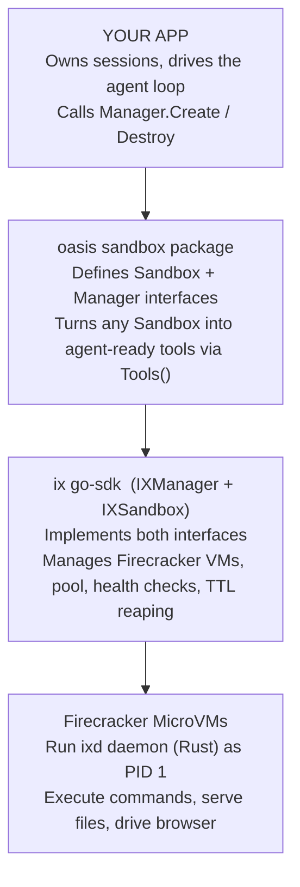

# 04 — Integrating ix into your application

<!-- source-of-truth: oasis sandbox/{sandbox,tools,lazy,manager}.go, go-sdk/{manager,sandbox}.go, athena internal/adapter/lazy_sandbox.go -->

> **Who should read this:** Go developers building an application that needs a safe, isolated environment for running agent-generated code, shell commands, file operations, or browser automation.
>
> **What you'll learn:** The single interface your app interacts with, how the layers fit together, a minimal working example, how tool auto-registration works, when to use lazy vs. eager sandbox creation, and how to integrate without oasis at all.

---

## 1. The contract

Your application never touches a Firecracker VM, vsock, or Firecracker's REST API directly. Everything goes through one Go interface:

```go
// github.com/nevindra/oasis/sandbox
type Sandbox interface {
    // --- Execution ---
    Shell(ctx context.Context, req ShellRequest) (ShellResult, error)
    ExecCode(ctx context.Context, req CodeRequest) (CodeResult, error)

    // --- Files ---
    ReadFile(ctx context.Context, req ReadFileRequest) (FileContent, error)
    WriteFile(ctx context.Context, req WriteFileRequest) error
    EditFile(ctx context.Context, req EditFileRequest) error
    UploadFile(ctx context.Context, path string, data io.Reader) error
    DownloadFile(ctx context.Context, path string) (io.ReadCloser, error)
    GlobFiles(ctx context.Context, req GlobRequest) (GlobResult, error)
    GrepFiles(ctx context.Context, req GrepRequest) (GrepResult, error)
    Tree(ctx context.Context, req TreeRequest) (TreeResult, error)

    // --- Web ---
    HTTPFetch(ctx context.Context, req HTTPFetchRequest) (HTTPFetchResult, error)
    WebSearch(ctx context.Context, req WebSearchRequest) (WebSearchResult, error)

    // --- Browser ---
    BrowserNavigate(ctx context.Context, url string) error
    BrowserScreenshot(ctx context.Context) ([]byte, error)
    BrowserAction(ctx context.Context, action BrowserAction) (BrowserResult, error)
    BrowserSnapshot(ctx context.Context, opts SnapshotOpts) (BrowserSnapshot, error)
    BrowserText(ctx context.Context, opts TextOpts) (BrowserTextResult, error)
    BrowserPDF(ctx context.Context) ([]byte, error)
    BrowserEval(ctx context.Context, expression string) (string, error)
    BrowserFind(ctx context.Context, query string) (BrowserFindResult, error)
    BrowserWait(ctx context.Context, opts BrowserWaitOpts) (BrowserWaitResult, error)

    // --- MCP ---
    MCPCall(ctx context.Context, req MCPRequest) (MCPResult, error)

    // --- Lifecycle ---
    WorkspaceInfo(ctx context.Context) (WorkspaceInfoResult, error)
    Close() error
}
```

That is the complete interface — 23 methods, grouped by concern. Any `Sandbox` value satisfying this contract could be backed by Firecracker, Docker, a mock for testing, or anything else. Your app code stays the same regardless.

The lifecycle side of the contract lives in `sandbox.Manager` — also a plain Go interface:

```go
type Manager interface {
    Create(ctx context.Context, opts CreateOpts) (Sandbox, error)
    Get(sessionID string) (Sandbox, error)
    Destroy(ctx context.Context, sessionID string) error
    Shutdown(ctx context.Context) error
    Close() error
}
```

`CreateOpts` is small and straightforward:

```go
type CreateOpts struct {
    SessionID string            // required; identifies the session (e.g. chat ID)
    Image     string            // empty = manager default rootfs
    TTL       time.Duration     // 0 = manager default (1 hour)
    Resources ResourceSpec      // zero values use manager defaults
    Env       map[string]string // extra env vars injected into the VM
    Browser   *bool             // nil = manager default; false = disable browser
}
```

---

## 2. The three-layer cake

Here is how the pieces stack from your code down to the metal:



One-line responsibilities:

| Layer | What it owns |
|---|---|
| **Your app** | Session IDs, the agent loop, when to create/destroy sandboxes |
| **oasis `sandbox` package** | The interface contract + `Tools()` to register them with your agent |
| **ix go-sdk** | Firecracker VM lifecycle, pool, vsock transport, health monitoring |
| **VMs (ixd)** | Actual execution: shell, code, file I/O, browser, egress firewall |

The key point is **substitutability**. The interface decouples every layer from the one above and below. A Docker-backed `Manager` would work with the same app code. A different agent framework would consume the same `[]AnyTool` slice from `Tools()`. You are not locked in.

---

## 3. Minimal integration

This is all it takes to wire ix into a Go application. Adapt `RootfsImage`, `KernelPath`, and `PoolSize` to your environment.

```go
package main

import (
    "context"
    "fmt"
    "log"

    ix "github.com/nevindra/ix/go-sdk"
    "github.com/nevindra/oasis/sandbox"
)

func main() {
    ctx := context.Background()

    // 1. Create the manager once at startup. It manages the VM pool,
    //    health checks, and TTL reaping for the whole process lifetime.
    mgr, err := ix.NewManager(ctx, ix.ManagerConfig{
        RootfsImage:    "/opt/ix/rootfs/base.ext4",
        KernelPath:     "/opt/ix/vmlinux",
        PoolSize:       3,                       // keep 3 VMs pre-warmed
        PreWarmKernels: []string{"python"},      // Python kernel ready on first use
    })
    if err != nil {
        log.Fatal(err)
    }
    defer mgr.Close()

    // 2. At session start, provision one sandbox per session.
    sessionID := "chat-abc123"
    sb, err := mgr.Create(ctx, sandbox.CreateOpts{
        SessionID: sessionID,
    })
    if err != nil {
        log.Fatal(err)
    }
    defer mgr.Destroy(ctx, sessionID) // clean up when the session ends

    // 3. Turn the sandbox into agent tools with one call.
    tools := sandbox.Tools(sb)

    // 4. Hand the tools to your agent framework.
    //    The exact API differs per framework; tools is []oasis.AnyTool.
    fmt.Printf("registered %d tools\n", len(tools)) // 20 tools

    // 5. You can also call sandbox methods directly without going through tools.
    result, err := sb.Shell(ctx, sandbox.ShellRequest{Command: "echo hello"})
    if err != nil {
        log.Fatal(err)
    }
    fmt.Println(result.Output)
}
```

`ix.NewManager` must be called once at process startup — it starts background goroutines for pool management, health monitoring, and TTL reaping. `mgr.Close()` on shutdown stops all VMs cleanly.

---

## 4. Tool auto-registration

`sandbox.Tools(sb, opts...)` converts a `Sandbox` into a `[]oasis.AnyTool` — a slice of ready-made tools your agent can call. You do not write tool descriptions, JSON schemas, or dispatch logic. They are already there.

With default options (browser included) you get **20 tools**. Grouped by family:

| Family | Tools |
|---|---|
| Execution | `shell`, `execute_code` |
| Files | `file_read`, `file_write`, `file_edit`, `file_glob`, `file_grep`, `file_tree` |
| Web | `http_fetch`, `web_search` |
| Browser | `browser`, `screenshot`, `snapshot`, `page_text`, `export_pdf`, `browser_eval`, `browser_find`, `browser_wait` |
| Utility | `workspace_info`, `mcp_call` |

A 21st tool, `deliver_file`, is added automatically when you pass a writable mount or `WithFileDelivery`.

**Option functions** let you trim the set:

```go
// Omit all 8 browser tools — use for "light" sandboxes with no Chrome.
tools := sandbox.Tools(sb, sandbox.WithoutBrowser())

// Attach filesystem mounts so file_write publishes back to a backend store.
tools := sandbox.Tools(sb, sandbox.WithMounts(specs, manifest))

// Legacy file delivery (deprecated; prefer WithMounts).
tools := sandbox.Tools(sb, sandbox.WithFileDelivery(myDelivery))
```

Use `WithoutBrowser()` whenever a session does not need browser capability. The model is never offered tools that would fail, so there is no risk of it trying to call `browser` and getting an error.

The tool descriptions are written specifically for LLMs — they explain what each tool does, when to use it, and common mistakes to avoid. Wiring them into an agent framework is genuinely zero extra prompt-engineering. You hand the slice to the framework; the model figures out the rest.

---

## 5. Lifecycle patterns

### Eager creation

The simplest pattern: create the sandbox when the session starts, destroy it when it ends.

```go
sb, _ := mgr.Create(ctx, sandbox.CreateOpts{SessionID: sessionID})
defer mgr.Destroy(ctx, sessionID)
tools := sandbox.Tools(sb)
// run agent...
```

**Downside:** most chat sessions never use a tool. If you pre-create a VM per chat, you pay for VMs that sit idle. With a `PoolSize > 0`, the hit is low but not zero.

### Lazy creation

The lazy pattern defers VM creation until the first tool call. The oasis sandbox package ships a `sandbox.Lazy` constructor built for this:

```go
// sandbox.Lazy returns a Sandbox that creates the real one on first use.
sb := sandbox.Lazy(func(ctx context.Context) (sandbox.Sandbox, error) {
    return mgr.Create(ctx, sandbox.CreateOpts{SessionID: sessionID})
})
tools := sandbox.Tools(sb) // tools are registered now, but no VM yet
// ...agent runs; VM is created only if the model calls a tool
defer sb.Close()
```

`sandbox.Lazy` is thread-safe. If creation fails, it is retried on the next call. `Close()` is always safe — if the sandbox was never created, it is a no-op.

### Session mapping

One session ID maps to one VM for the duration of the session. The manager keeps a map; `mgr.Get(sessionID)` retrieves an existing sandbox by that ID. Always use a stable, unique identifier — a conversation ID, a chat ID, anything that lives as long as the session does.

### Cleanup

There are two cleanup mechanisms:

- **TTL reaping** — the manager's background reaper checks sandboxes every 30 seconds and destroys those past their TTL (default: 1 hour). Safe for cases where sessions end without an explicit cleanup call.
- **Explicit Destroy** — `mgr.Destroy(ctx, sessionID)` stops the VM immediately. Prefer this when you know the session is over (e.g., user closes the chat). It frees the concurrency slot right away and keeps the pool available for new sessions.

Both are safe to use together.

---

## 6. Case study: athena

Athena is a production application built on ix. It follows the patterns above and adds two refinements worth knowing.

### Lazy sandbox adapter

Athena uses its own `lazySandbox` adapter rather than the oasis built-in `sandbox.Lazy`. The difference: athena's version calls `mgr.Get(sessionID)` on every method call instead of caching the reference. This makes health-monitor restarts transparent — if the manager replaces the `IXSandbox` object after a crash, the adapter picks up the new one automatically on the next call.

It also supports mount prefetching: when the lazy sandbox materializes, it immediately runs `PrefetchMounts` to copy readable files from the backing store into the sandbox workspace, so the agent finds its inputs on the first tool call.

### Selective retry policy

Athena wraps some operations in a small `withRetry` helper but deliberately skips it for others:

| Retried | Not retried |
|---|---|
| `Shell`, `ExecCode`, `ReadFile` | `WriteFile`, `EditFile`, `UploadFile` |
| `BrowserNavigate`, `BrowserSnapshot`, `BrowserText`, `BrowserPDF` | `BrowserAction`, `BrowserEval`, `BrowserWait`, `BrowserFind` |
| `GlobFiles`, `GrepFiles`, `Tree`, `HTTPFetch`, `WebSearch` | `MCPCall` |

The reasoning: read-like and navigate operations are generally safe to retry — if the VM restarted, re-fetching a page or re-reading a file causes no harm. But **browser actions are not idempotent**. Retrying a click, a form fill, or a JavaScript eval could double-submit a form, corrupt state, or produce unpredictable side effects. The same logic applies to writes.

This is one reasonable approach, not a requirement imposed by ix. Your own retry policy should be guided by what your app's operations actually do.

---

## 7. Integrating without oasis (non-Go apps)

The ix daemon is a plain HTTP server running inside the VM. If you cannot use the Go SDK — for example, you are building a Python or TypeScript service — you can talk to it directly over HTTP.

When running as a Docker container (`docker run -p 8080:8080 ghcr.io/nevindra/oasis-sandbox-ix:latest`), the daemon listens on TCP port 8080 and all routes are reachable over plain HTTP. You skip the vsock transport entirely.

### Main endpoint families

| Prefix | Methods | What it does |
|---|---|---|
| `/health` | GET | Health check; returns 200 when ready |
| `/v1/shell/exec` | POST | Run a shell command; response is an SSE stream |
| `/v1/code/execute` | POST | Execute code in a language runtime; SSE stream |
| `/v1/file/{read,write,edit,glob,grep,tree,stat,upload,download,ls}` | POST / GET | File operations; read/write/search/tree etc. |
| `/v1/browser/{navigate,screenshot,action,snapshot,text,pdf,evaluate,find,wait}` | POST / GET | Full browser automation surface |
| `/v1/http/fetch` | POST | Fetch a URL, extract readable text |
| `/v1/web/search` | POST | Web search, returns structured results |
| `/v1/workspace/info` | GET | OS, arch, working directory, installed tools |
| `/v1/egress/policy` | GET / PATCH | Read or update the DNS egress policy at runtime |

**Streaming:** shell and code-execute endpoints respond with [Server-Sent Events](https://developer.mozilla.org/en-US/docs/Web/API/Server-sent_events) (SSE). Each event has a `type` (`stdout`, `stderr`, `complete`, `error`) and a JSON `data` payload. One-shot endpoints (file operations, browser actions) respond with plain JSON.

**E2B-compatible surface:** the daemon also exposes `/sandboxes/{id}/commands/run`, `/sandboxes/{id}/code/execute`, and `/sandboxes/{id}/files` routes that mirror the E2B API shape. The `{id}` path segment is accepted but ignored — the daemon manages one workspace per VM, not per request. This lets you drop ix in as a self-hosted E2B replacement.

### Honest caveats

When you go direct-HTTP, you give up everything the Go SDK provides for free:

- VM pool (pre-warmed VMs for near-instant starts)
- Health monitoring and automatic restart
- TTL reaping and concurrency limiting
- Pool replenishment and snapshot restore

These are non-trivial to reimplement. For simple use cases — a single long-running container, a local dev sandbox, or quick experimentation — direct HTTP is fine. For production multi-tenant deployments, the Go SDK is the practical path.

---

## Where to go next

- **[README.md](../../README.md)** — index and quick-start
- **[01-what-is-ix.md](01-what-is-ix.md)** — big picture: what ix is and why it exists
- **[02-architecture.md](02-architecture.md)** — how the layers work internally
- **[03-browser.md](03-browser.md)** — browser tier, in-VM vs. shared mode
- **[05-operations.md](05-operations.md)** — running ix in production: pool tuning, egress policy, snapshots
