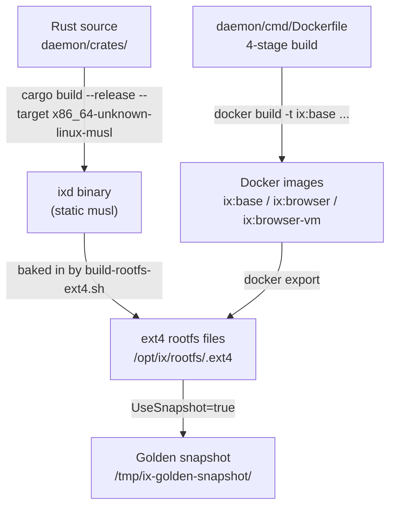
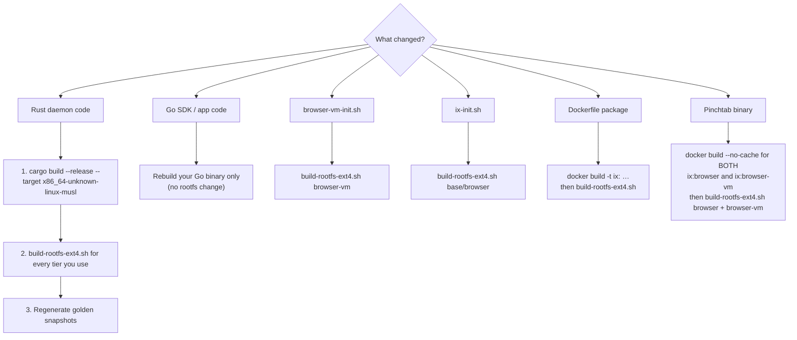

# 05 — Operations: running ix

> **Who should read this:** Anyone who builds, deploys, or keeps an ix-based system running — a developer setting up a dev machine, a DevOps engineer preparing a production host, or an on-call engineer tracking down why a sandbox is misbehaving.
>
> **What you'll learn:** What you need before you start, how to build every rootfs tier from scratch, what to rebuild when you change something, how to set up the optional shared browser tier, how golden snapshots work and when to regenerate them, and what the background health machinery is doing day-to-day.

<!-- source-of-truth: go-sdk/scripts/*.sh, daemon/cmd/Dockerfile, daemon/cmd/browser-vm-init.sh -->

---

## 1. What you need

Run these verify commands on any machine before you do anything else.

### Linux x86_64 with KVM

Firecracker only works on Linux x86_64 with hardware virtualisation enabled. KVM (Kernel-based Virtual Machine) is the Linux module that exposes that hardware to processes.

```bash
ls /dev/kvm          # must exist
uname -m             # must print x86_64
```

If `/dev/kvm` is missing, enable virtualisation in your BIOS/UEFI and load the module:

```bash
sudo modprobe kvm_intel   # Intel CPUs
# or
sudo modprobe kvm_amd     # AMD CPUs
```

Also make sure your user can open the device:

```bash
stat /dev/kvm | grep Gid          # find the owning group (usually "kvm")
sudo usermod -aG kvm "$USER"      # add yourself; log out and back in
ls -l /dev/kvm                    # should show rw for your group
```

### Firecracker v1.12+

Firecracker — the open-source microVM monitor from AWS — is the process that boots each sandbox. The install script fetches both the binary and a pre-built kernel from Firecracker's CI bucket and puts them in `/opt/ix/firecracker/`.

```bash
cd go-sdk
./scripts/install-firecracker.sh          # installs v1.15.1 by default
./scripts/install-firecracker.sh 1.12.0   # pin a specific version
```

After installation, add the binaries and kernel to your environment (the script prints the exact lines to add):

```bash
export IX_FC_BINARY=/opt/ix/firecracker/firecracker
export IX_KERNEL_PATH=/opt/ix/firecracker/vmlinux.bin

# Verify
$IX_FC_BINARY --version      # should print Firecracker v1.x.x
ls -lh $IX_KERNEL_PATH
```

### Docker

Docker is only needed to **build** rootfs images. Each rootfs tier is a Docker image exported to an ext4 file. You do not need Docker at runtime.

```bash
docker --version     # any recent version works
```

### Go 1.22+

The host SDK (`go-sdk/`) is a Go library. You need Go to build and import it.

```bash
go version           # must be go1.22 or newer
```

---

## 2. Building blocks

### The build pipeline

Every sandbox needs three things: the Rust daemon binary (`ixd`), a Linux kernel (`vmlinux`), and a root filesystem (`<tier>.ext4` — the VM's hard disk as a single file; everything the sandbox sees is inside it).



### Tier table

| Tier | Docker stage | Contents | Approx. size | When you need it |
|---|---|---|---|---|
| `base` | `base` | Ubuntu 24.04, Python 3, Node.js, uv, git, curl, `ixd` | ~750 MB | Default — all non-browser workloads |
| `browser` | `browser` | base + Chrome, Pinchtab, playwright-core | ~1.9 GB | Per-chat in-VM Chrome (mode 1) |
| `browser-vm` | `browser-vm` | **Standalone slim**: Chrome + Pinchtab server + socat/wget/iproute2 only — **no `ixd`, no Python, no Node** | ~1.3 GB | Shared browser tier only (mode 2) |

Need scientific Python (numpy, pandas, matplotlib, …)? There is deliberately no pre-baked tier for it — agents can `uv pip install` packages at runtime, or you can add your own Docker stage on top of `browser`.

Two structural notes:

- `base` includes Node.js, installed from the official nodejs.org tarball straight into
  `/usr/local` so `node`/`npm`/`npx` sit on the default PATH — that placement matters because
  Docker `ENV PATH` does not survive into a Firecracker VM, and the `execute_code` JS REPL
  spawns a bare `node` from PATH.
- `browser-vm` is deliberately **not** built on the other stages: the dedicated browser VM only
  runs Pinchtab in server mode plus Chrome, so it skips the entire sandbox runtime. Its init
  script is `browser-vm-init.sh`, not `ix-init.sh`, and `ixd` is absent.

### Step-by-step build commands

#### Step 1 — Build the ixd binary

This produces a fully static binary (no glibc dependency) that can run inside any Linux rootfs.

```bash
cd daemon
cargo build --release --target x86_64-unknown-linux-musl -p ix-server
# Output: daemon/target/x86_64-unknown-linux-musl/release/ixd
```

#### Step 2 — Build the Docker image for your tier

The Dockerfile has four stages (`builder`, `base`, `browser`, `browser-vm`). Build only the stage(s) you need. The sandbox stages inherit from each other (`base` → `browser`), so building `browser` also rebuilds `base`. `browser-vm` is standalone — it shares no layers with the others, so base/browser changes never invalidate its build cache.

```bash
# Base tier only
docker build -t ix:base --target base -f daemon/cmd/Dockerfile daemon/

# Browser tier (includes base)
docker build -t ix:browser --target browser -f daemon/cmd/Dockerfile daemon/

# Browser-VM tier (standalone slim: Chrome + pinchtab server only)
docker build -t ix:browser-vm --target browser-vm -f daemon/cmd/Dockerfile daemon/
```

#### Step 3 — Export to an ext4 rootfs file

`build-rootfs-ext4.sh` takes a tier name, exports the Docker image filesystem, injects the `ixd` binary and `ix-init.sh` (or `browser-vm-init.sh` for the `browser-vm` tier), and writes an ext4 image.

```bash
cd go-sdk

# Default output: /opt/ix/rootfs/<tier>.ext4
# Default size: 2048 MB (override with IX_ROOTFS_SIZE=<MB>)

./scripts/build-rootfs-ext4.sh base
./scripts/build-rootfs-ext4.sh browser
./scripts/build-rootfs-ext4.sh browser-vm

# Override output path:
IX_ROOTFS_IMAGE=/my/path/base.ext4 ./scripts/build-rootfs-ext4.sh base

# Override image size (MB):
IX_ROOTFS_SIZE=4096 ./scripts/build-rootfs-ext4.sh browser
```

The script expects the musl `ixd` binary at `daemon/target/x86_64-unknown-linux-musl/release/ixd` (relative to the repo root). Build it first.

Verify the output:

```bash
file /opt/ix/rootfs/base.ext4     # should say: Linux rev 1.0 ext2 filesystem data
du -h /opt/ix/rootfs/base.ext4
```

---

### "I changed X — what do I rebuild?"

This is the most important table in this document. Getting it wrong means running old code inside your VMs.

| What changed | Rebuild | Why |
|---|---|---|
| Any Rust code in `daemon/` | Re-run `cargo build --release --target x86_64-unknown-linux-musl -p ix-server`, then rebuild **every `.ext4` tier you use**, then **regenerate golden snapshots** | `ixd` lives inside the rootfs; the running binary is the one copied in at ext4 build time. A golden snapshot has `ixd` frozen in memory — replacing the `.ext4` alone does not update a snapshot. |
| `go-sdk/` code, your app code, Oasis | Rebuild your Go app binary only | The gateway and pool logic run in your app's process on the host, not inside any VM. No rootfs change needed. |
| `daemon/cmd/browser-vm-init.sh` | Rebuild `browser-vm.ext4` only | The script is overlaid from the repo by `build-rootfs-ext4.sh`; a fresh ext4 picks it up automatically. No full Docker image rebuild needed. |
| `go-sdk/scripts/ix-init.sh` | Rebuild every `.ext4` tier that uses it (`base`, `browser`) | Same overlay mechanism as `browser-vm-init.sh`. |
| A Python package or system package in a Dockerfile stage | Rebuild that Docker image (`docker build -t ix:<tier> …`), then rebuild its `.ext4` | Package changes live in the Docker layer, not in the scripts. |
| Pinchtab binary (pulled from `pinchtab/pinchtab:latest` in the Dockerfile) | Rebuild **both** images with `--no-cache` (`ix:browser` and `ix:browser-vm` — they are independent stages that each copy the binary), then rebuild `browser.ext4` and `browser-vm.ext4` | The binary is baked into each stage separately; `browser-vm` no longer inherits from `browser`. |
| `go-sdk/scripts/install-firecracker.sh` or kernel | Re-run `./scripts/install-firecracker.sh`, update `IX_KERNEL_PATH` | Kernel and Firecracker binary live on the host, not in the rootfs. |



---

## 3. Deploying the shared browser tier (optional)

By default, each chat VM runs its own Pinchtab + Chrome. That is simple and isolated, but expensive at scale (one ~700 MB Chrome per concurrent chat). The **shared browser tier** is one dedicated `browser-vm` VM running Pinchtab in server mode, shared across all chats. Enable it only if you need it.

**The order matters.** Do these steps in sequence:

### Step 1 — Build `browser-vm.ext4`

```bash
docker build -t ix:browser-vm --target browser-vm -f daemon/cmd/Dockerfile daemon/
cd go-sdk
./scripts/build-rootfs-ext4.sh browser-vm
# Output: /opt/ix/rootfs/browser-vm.ext4
```

### Step 2 — Configure the manager with `BrowserMode: "remote"`

When you pass `BrowserMode: "remote"`, `NewManager` automatically:

1. Boots the `browser-vm.ext4` as a dedicated Firecracker VM.
2. Waits up to 60 seconds for Pinchtab's `/health` endpoint to respond over vsock.
3. Creates a `Gateway` (a host-side HTTP proxy) using `NewGatewayForBrowserVM`, wired to the browser VM via vsock transport.
4. Starts an HTTP server on `GatewayListenAddr` (default `169.254.0.1:9100` — a link-local address reachable from guests via their per-VM TAP route).
5. Injects `IX_BROWSER_MODE=remote=<gateway-url>` and `IX_CHAT_ID=<session-id>` into every per-chat VM's kernel command line automatically.

```go
mgr, err := ix.NewManager(ctx, ix.ManagerConfig{
    RootfsImage:    "/opt/ix/rootfs/base.ext4",   // per-chat VMs use base
    KernelPath:     "/opt/ix/firecracker/vmlinux.bin",
    BrowserMode:    "remote",
    BrowserVMImage: "/opt/ix/rootfs/browser-vm.ext4",

    // Optional: persist browser profiles (cookies, sessions) across restarts.
    // Omit for an ephemeral setup.
    BrowserStateImage: "/opt/ix/rootfs/browser-state.ext4",

    // Optional: override the default gateway address and auth token.
    // GatewayListenAddr: "169.254.0.1:9100",  // default
    // GatewayToken:      "ix-internal",         // default; change for prod
    // BrowserVMMemoryMB: 4096,                  // default
})
```

You do **not** start the gateway separately — it is owned and started by `NewManager`. When `mgr.Close()` is called, the gateway and the browser VM are both shut down.

### How the gateway is wired internally

- `startBrowserTier` boots the browser-tier VM with `startVMCold`, waits for Pinchtab health via vsock, then calls `NewGatewayForBrowserVM(handle.VsockPath, token, maxInflight, logger)`.
- `NewGatewayForBrowserVM` builds an `http.Client` with a vsock transport and passes it to `NewGateway` with `PinchtabBaseURL: "http://browser-vm"` (the hostname is irrelevant — the vsock transport ignores it).
- `gw.Handler()` returns a `net/http.ServeMux` that exposes `/v1/browser/*`, `DELETE /chats/{chatId}`, `GET /health`, and `GET /metrics`.
- The gateway heartbeat (`gw.Start(ctx)`) polls Pinchtab `/health` every 10 seconds and moves to `unhealthy` after three consecutive failures, at which point browser calls return 503.

### Environment variables injected by the SDK

| Variable | Value | Purpose |
|---|---|---|
| `IX_BROWSER_MODE` | `remote=http://169.254.0.1:9100` | Tells `ixd` to proxy browser calls to the gateway instead of starting local Chrome |
| `IX_CHAT_ID` | session ID | Routing key — the gateway creates one Pinchtab instance per unique chat ID |
| `IX_BROWSER_GATEWAY_TOKEN` | the `GatewayToken` value | Auth token forwarded by `ixd` to the gateway on each browser call |

---

## 4. Golden snapshots

### What they are

A golden snapshot is a frozen image of a running VM taken right after boot and Python kernel warm-up. Restoring a snapshot is roughly 10× faster than a cold boot because the OS, daemon, and Python interpreter are all already in memory — only a health poll is needed to confirm the restored VM is live.

### How they are created

With `UseSnapshot: true`, `NewManager` asynchronously:

1. Boots a temporary "golden" VM.
2. Waits for `ixd` to send its `READY\n` signal over vsock.
3. Sends a no-op Python code execution to pre-warm the REPL process.
4. Pauses the VM (Firecracker PATCH `/vm` → `"Paused"`).
5. Writes a Full snapshot to `SnapshotDir` (`snapshot.state` + `snapshot.mem`).
6. Kills the golden VM.

Until the golden snapshot is ready, `NewManager` falls back to cold boot automatically.

### Configuration knobs

```go
ix.ManagerConfig{
    UseSnapshot: true,
    SnapshotDir: "/tmp/ix-golden-snapshot",  // default
    // SnapshotDir: "/opt/ix/snapshots",      // use a persistent path for prod
}
```

`PreWarmKernels` controls which language REPLs are started inside pool-entry VMs (not the golden snapshot itself — the golden snapshot always pre-warms Python):

```go
PreWarmKernels: []string{"python"},  // boots the Python kernel before a pool VM is claimed
```

### The golden rule: regenerate after every rootfs rebuild

A golden snapshot contains the `ixd` process frozen in memory. If you replace the `.ext4` file but keep an old snapshot, every restored VM runs the **old daemon** while the rootfs has the **new one**. This is the most common source of confusing bugs (for example, `browser_wait` returning 404 when the route was added in the new `ixd`).

Always regenerate the snapshot after rebuilding the rootfs:

```bash
# Option A: delete the snapshot directory; NewManager will recreate it on next start.
rm -rf /tmp/ix-golden-snapshot

# Option B: in production, point SnapshotDir at a versioned path
# e.g. SnapshotDir = "/opt/ix/snapshots/v3"
# and update it when you deploy new rootfs images.
```

---

## 5. Upgrading to rootfs isolation (immutable base + per-VM scratch)

This section applies when deploying the version that introduced `ix-stage0` — the whole-root overlayfs pre-init that gives each VM a private scratch disk while sharing a single read-only rootfs image. If you are doing a fresh install you can skip it; if you are upgrading an existing deployment, read this carefully.

### What changed

Previously every VM mounted the shared rootfs image read-write. Now:

- The rootfs image is attached **read-only** at the Firecracker level (`is_read_only: true`).
- Each VM gets a private sparse scratch disk (`scratch.ext4`) under `RunDir`.
- `/sbin/ix-stage0` (a new pre-init binary baked into the rootfs) builds a whole-root overlayfs at boot and `pivot_root`s into it before `ixd` starts.

### Required steps before running the new version

**1. Rebuild all rootfs images.** `ix-stage0` and the `/scratch` mountpoint directory must be baked into the ext4 image. A rootfs built without them will fail to boot.

```bash
# Rebuild every tier you use
cd daemon
cargo build --release --target x86_64-unknown-linux-musl -p ix-server

cd ..
cd go-sdk
./scripts/build-rootfs-ext4.sh base
./scripts/build-rootfs-ext4.sh browser          # if you use the browser tier
./scripts/build-rootfs-ext4.sh browser-vm       # if you use the shared browser tier
```

**2. Delete stale golden snapshots.** An old snapshot has the rootfs in read-write mode frozen into its state. Loading it with the new code causes corruption or a boot failure. Delete the snapshot directory before starting the new version — `NewManager` will recreate it automatically.

```bash
rm -rf /tmp/ix-golden-snapshot      # or wherever SnapshotDir points in your config
```

**3. Verify the guest kernel has overlayfs support.** `ix-stage0` uses `mount --type overlay`. The kernel must have `CONFIG_OVERLAY_FS=y` built-in (not as a module — the pre-init runs before the real rootfs is mounted, so modules are unavailable). The kernel shipped by `install-firecracker.sh` already satisfies this; check only if you use a custom kernel.

```bash
grep CONFIG_OVERLAY_FS /path/to/your/vmlinux.config   # should show =y
```

### Configuration knobs

| Key | Default | Notes |
|---|---|---|
| `RunDir` | `<dir of RootfsImage>/run` | Where per-VM run directories (and scratch disks) are created. **Must not be on tmpfs** — the scratch disk needs to persist across the pivot_root; a tmpfs RunDir silently loses all writes after a reboot of the host. |
| `ScratchSizeMB` | `10240` (10 GB) | Size of each VM's sparse scratch disk. Sparse — the disk image only consumes space proportional to what the guest actually writes, not the full 10 GB up front. Acts as the per-sandbox disk quota. |

> **`RunDir` must not be on tmpfs.** The scratch ext4 images are per-VM persistent state; placing them on a tmpfs would make every write in the guest vanish on host reboot and would also prevent the overlayfs from functioning correctly. The default (`<rootfs dir>/run`) uses the same filesystem as the rootfs image, which is always a real block device or regular directory.

---

## 6. Day-2 operations

### Background goroutines and their intervals

`NewManager` starts three background goroutines. Here are their real defaults from `manager.go`, `health.go`, and `reaper.go`:

| Goroutine | Interval | What it does |
|---|---|---|
| **monitor** | every 10 s | Calls `GET /health` on every active sandbox. Three consecutive failures trigger a restart. |
| **reaper** | every 30 s | Destroys sandboxes whose TTL has elapsed (default 1 hour). Also destroys the oldest sandbox when free disk space on the rootfs path falls below 5 GB. |
| **poolReplenisher** | every 1 s | Checks if the pool has fallen below `PoolMinReady` and starts new VMs in parallel (up to `PoolWorkers` at once, default 3) to refill it to `PoolSize`. |

### What "healthy" means

A sandbox is healthy if `GET /health` returns HTTP 200. The `ixd` daemon exposes this endpoint; it returns 200 as long as the process is running and its HTTP server is accepting connections. No authentication is required for the `/health` endpoint on per-chat VMs.

### TTL and reaping

Every sandbox has an expiry time set at creation (`DefaultTTL`, default 1 hour). The reaper checks every 30 seconds and destroys any sandbox that has passed its `expiresAt`. If you need a longer-lived sandbox, set `DefaultTTL` in `ManagerConfig` or pass `TTL` in `CreateOpts`.

Disk-pressure reaping is a last resort: if the filesystem containing your rootfs image has fewer than 5 GB free, the reaper destroys the oldest (by creation time) running sandbox, regardless of TTL.

### Restart circuit breaker

If a sandbox fails three consecutive health checks, the monitor restarts it (kills the old VM, boots a fresh one with the same session ID). If a sandbox has been restarted `MaxRestarts` times (default 3) and still fails, the circuit breaker fires: the sandbox is permanently destroyed and removed. Your application must handle `ErrNotFound` from `mgr.Get(sessionID)` at that point.

### Pool refill behaviour

When a pool VM is claimed (`mgr.Create()` grabs it), the manager immediately launches an async goroutine to create one replacement VM. The background `poolReplenisher` ticks every 1 second and fills up to `PoolSize` using up to `PoolWorkers` parallel goroutines. Pool creation counts toward `MaxConcurrent`.

### Two-phase destroy

`Destroy` returns after the *synchronous* phase: the VM process is killed, the TAP device is released, and the VM's directory is renamed to a tombstone (`ix-<id>.deleting.<n>`). The expensive part — deleting the per-VM scratch disk, a sparse file up to 10 GB — runs *asynchronously* after the call returns.

Operational consequences:

- **Disk reclaim is deferred.** Under heavy create/destroy churn, transient disk usage is higher than the live-VM count implies, because tombstones awaiting deletion still hold their scratch files. The reaper's disk-pressure check (5 GB threshold) can fire on tombstone backlog even when few VMs are running.
- **Crashes leave tombstones.** If the process dies between the rename and the background `RemoveAll`, the tombstone directory survives. This is safe by design: tombstones keep the `ix-` prefix, so startup orphan recovery sweeps them (see below).
- **The caller-visible latency win is workload-dependent.** For a freshly-created VM the scratch is nearly empty and `Destroy` was already dominated by process kill+wait (~25 ms). The two-phase design matters for VMs that *wrote* gigabytes to their scratch — that deletion no longer blocks the caller.

### Orphan recovery on startup

`NewManager` scans the run directory for `ix-*` entries left over from a previous manager run and removes them — stale vsock socket dirs, interrupted-destroy tombstones (`ix-<id>.deleting.<n>`), and the scratch pre-copy pool (`ix-scratch-pool`, rebuilt on demand). This prevents stale sockets and orphaned scratch disks from accumulating across restarts. VM process recovery is not supported — orphaned VM processes are not re-adopted.

---

## 7. Troubleshooting

| Symptom | Likely cause | What to check |
|---|---|---|
| `NewManager` returns "rootfs image not found" or "kernel path not found" | Wrong path in config or files not built yet | Check `RootfsImage` and `KernelPath` paths exist: `ls -lh /opt/ix/rootfs/base.ext4 /opt/ix/firecracker/vmlinux.bin` |
| `NewManager` returns "firecracker not found in PATH" | Firecracker binary not installed or not in PATH | Run `install-firecracker.sh`, then set `IX_FC_BINARY` or add `/opt/ix/firecracker/` to PATH |
| Sandbox create fails immediately | `/dev/kvm` not accessible | `ls -l /dev/kvm`, check group membership (`groups`), add yourself with `sudo usermod -aG kvm $USER` |
| VM never becomes ready (create times out) | Kernel path wrong, vsock misconfigured, or `ixd` not in rootfs | Check `IX_KERNEL_PATH` points to a valid vmlinux; verify `ixd` is in the rootfs (`sudo mount -o loop /opt/ix/rootfs/base.ext4 /mnt && ls /mnt/usr/local/bin/ixd && sudo umount /mnt`); check Firecracker stderr by running it manually |
| `browser_wait` returns 404 | Old `ixd` binary in rootfs (route added in newer daemon) | Rebuild the musl `ixd` binary, rebuild the `.ext4`, regenerate the golden snapshot |
| `browser_eval` returns 403 `evaluate_disabled` | Old `PINCHTAB_CONFIG` with `allowEvaluate: false` (baked into an old `browser-vm.ext4`) | Rebuild `ix:browser-vm` Docker image and `browser-vm.ext4`; `browser-vm-init.sh` now writes `"allowEvaluate": true` in the config |
| `browser_eval` returns 500 "failed to parse … response: error decoding response body" | Old `ixd` that required pinchtab's eval `result` to be a string; pinchtab returns the raw JSON value of the expression (`1+1` → `2`) | Rebuild `ixd` (fix lives in `ix-browser/src/eval.rs`), rebuild the rootfs, regenerate the golden snapshot |
| `browser_screenshot`/`browser_pdf` intermittently 500 after ~30 s | Old timeout tie: pinchtab `actionSec` (30 s) raced the daemon's 30 s client timeout on slow cold-Chrome captures | Rebuild `ixd` AND `browser-vm.ext4` (chain is now pinchtab 60 s < gateway client 75 s < daemon capture timeout 90 s) |
| Browser ops return 404 "tab not found" via gateway | Old Pinchtab binary that filtered out blank tabs | Rebuild `ix:browser-vm` with a fresh Pinchtab pull (`docker build --no-cache …`), rebuild `browser-vm.ext4` |
| Browser ops return 503 "browser upstream unavailable" | Gateway's heartbeat has marked Pinchtab unhealthy; browser-tier VM is down or overloaded | `GET http://169.254.0.1:9100/health` from the host; check `GET /metrics` for in-flight count; check Firecracker process for the browser-tier VM is still running |
| Browser ops return 503 in **local** mode (no gateway) | Chat VM was built with `base.ext4` but code expects a browser; Chrome / Pinchtab not in `base` tier | Use `browser.ext4` for VMs that need in-VM Chrome |
| Slow first code execution (seconds, not ms) | No pre-warmed pool or snapshot | Set `PoolSize > 0` with `PreWarmKernels: ["python"]`, or enable `UseSnapshot: true` |
| `browser_wait` returns NotFound via gateway | Pinchtab returned 404 because the tab was transient (opened to `about:blank`) — old gateway logic | Update `go-sdk` to current version; the gateway now opens tabs directly at the target URL |
| Snapshots seem to use old daemon | Golden snapshot not regenerated after rootfs rebuild | Delete `SnapshotDir` (default `/tmp/ix-golden-snapshot`) and restart your app so `NewManager` creates a fresh snapshot |
| "custom NetworkCIDR not yet supported" on startup | Custom `NetworkCIDR` was set | Leave `NetworkCIDR` empty to use the default `172.16.0.0/16` |
| Gateway listen fails "address already in use" | Another process (or a previous manager) is using `169.254.0.1:9100` | Check `ss -tlnp | grep 9100`; change `GatewayListenAddr` in config |
| VM panics at boot with "overlay: missing 'lowerdir'" or hangs in `ix-stage0` | Rootfs built without `ix-stage0` or `/scratch` directory | Rebuild the rootfs image (`build-rootfs-ext4.sh`); verify `/sbin/ix-stage0` and `/scratch` exist in the ext4 |
| VM panics with "unknown filesystem type 'overlay'" | Guest kernel built without `CONFIG_OVERLAY_FS=y` | Use the kernel from `install-firecracker.sh`, or rebuild your custom kernel with overlayfs built in (not as a module) |
| Disk writes inside VM vanish after host reboot | `RunDir` is on a tmpfs | Set `RunDir` to a persistent filesystem path (default is the same directory as the rootfs image) |

---

## Where to go next

- [README.md](README.md) — index of all handbook documents
- [01-what-is-ix.md](01-what-is-ix.md) — big picture: what ix does and why
- [02-architecture.md](02-architecture.md) — how the pieces fit together
- [03-browser.md](03-browser.md) — browser tier in depth
- [04-integration.md](04-integration.md) — integrating ix into your Go application
